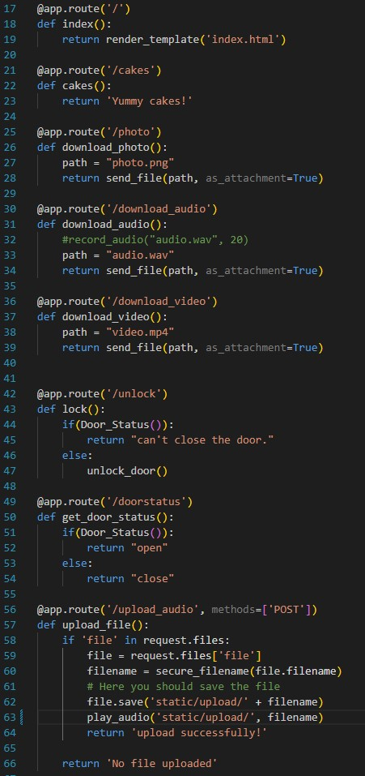
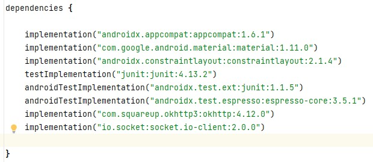
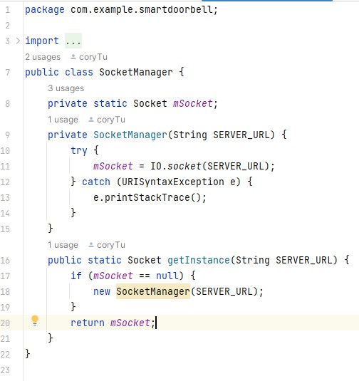
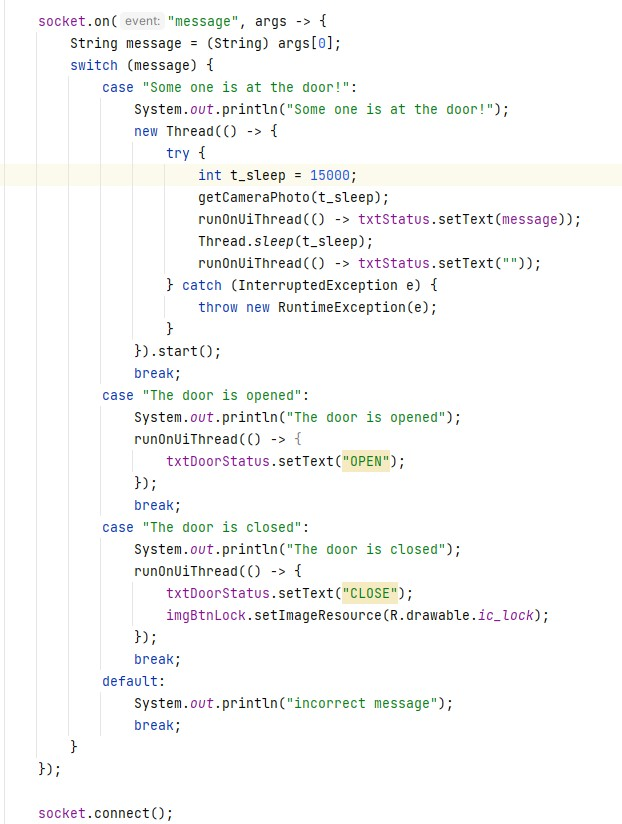
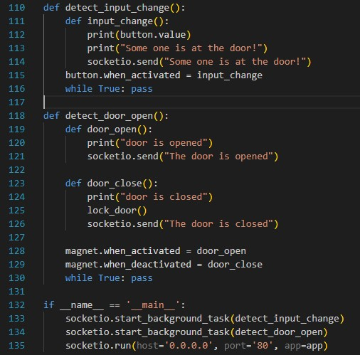
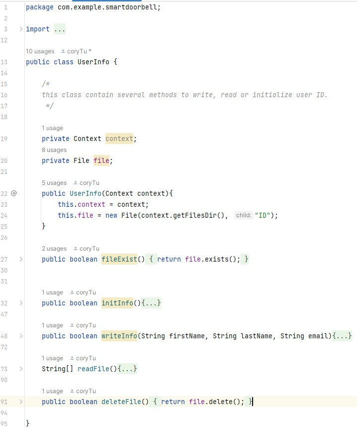

## flask

Initially, we try to use database as a bridge to transmit message between pi and android. However, it fail for some reason:

1. some data like photo, video and audio need to be encoded into other format to be stored in database and need to be decode on android side after transmission.
2. when somebody press the button, the message need to be transmit to android immediately, which is not possible through database.

Therefore, in order to achieve real time message transmission, we use another way to communicate between android and pi. We use a light-weight python web frame work call flask to set up a http server on raspberry pi and provide several api for the android app to get access to data on pi as a http client. The android and pi need to be in the same LAN.

Here is all the api that we provided: 

## flask-socketio

With the help of flask web framework, the android app can trigger action on raspberry pi, like open the lock or record an audio, by sending a http get request to pi server. However, under some situation, we want the server to initiate connection with android client and send message to it, which is quite difficult because once one communication is over, the connection is cut off. Therefore,  we use a Socket.IO integration for Flask applications call flask-socketio to set up long-life, bi-directional connection between pi and android. SocketIO is an event-driven library for real-time web applications. It enables real-time, bi-directional communication between web clients and servers. 

On the android side, we use the java implementation of SocketIO to set up a socket client to receive message. Here we can see that the SocketIO dependency is added to android project and a SocketManager java class is written to handle with socket object.

In the MainActicity, a function is written to handle with the message receiving from server.

Depends on different message, the app do different operation. For example, if the message from raspberry pi is "some body is at the door!", then the app will send a request to ask pi to take a picture of the visitor and show the picture together with the message on the home page for 15 seconds. 

On the server side, we have two function to listen to the status of the door and button, and we let them work on another thread by adding these two function to background. 

## User Information

On the android app, we have user management functions to check the permission of user. The android app can get access to a mySQL database, read user information or register new user. Therefore, we need a file at local to store the user information. A userInfo java class is written to manage user information. The following show all the method of a userInfo class. 

The UserInfo class needs to get the context of current running app, which can be get by the method getApplicationContext().
